# Provenance Guard

The goal of Provenance Guard is to try and predict whether a piece of text is AI or
human generated by analyzing the piece with two or more signals — while communicating uncertainty honestly and giving creators a way to contest a classification.

## Setup & Running

```bash
python -m venv .venv
source .venv/bin/activate
pip install -r requirements.txt
# create a .env file with:  GROQ_API_KEY=your_key_here
python app.py            # runs on http://127.0.0.1:8000
```

> Note: the app runs on port **8000**, not 5000 — on macOS the AirPlay Receiver
> squats on port 5000 and will intercept requests.

## API Endpoints

| Method | Path | Accepts | Returns |
|---|---|---|---|
| POST | `/submit` | `text`, `creator_id` | `content_id`, `attribution`, `confidence`, `label`, `signals` |
| POST | `/appeal` | `content_id`, `creator_reasoning` | confirmation + `status: under_review` |
| GET  | `/log` | — | recent structured audit-log entries |

## Architecture Overview

```mermaid
flowchart TD
    subgraph Submission Flow
        A[Client] -->|"POST /submit<br/>text + creator_id"| B[/submit endpoint/]
        B -->|raw text| C[Groq signal]
        B -->|raw text| D["Heuristic signal<br/>(burstiness, TTR, punctuation)"]
        C -->|"P_groq (0-1)"| E[Combine]
        D -->|"P_heur (0-1)"| E
        E -->|"P(AI) = 0.75·Groq + 0.25·Heuristic"| F[Interpret via threshold table]
        F -->|"attribution<br/>(human … AI)"| G[Label generator]
        G -->|label text| H[(Audit log)]
        H -->|"content_id, P_groq, P_heur,<br/>P(AI), attribution, label"| I[Response to client]
    end

    subgraph Appeal Flow
        J[Client] -->|"POST /appeal<br/>content_id + reasoning"| K[/appeal endpoint/]
        K -->|"set status = under_review"| L[Update stored record]
        L -->|"appeal + original scores<br/>(P_groq, P_heur, P(AI))"| M[(Audit log)]
        M -->|confirmation| N[Response to client]
    end
```



**Submission flow:** A creator POSTs text to `/submit`; the text is scored independently by the Groq signal and the stylometric heuristic, which are combined into a single `P(AI)`. That score is mapped to one of five attribution states, turned into a transparency label, written to the audit log, and returned to the caller.

**Appeal flow:** A creator POSTs a `content_id` and their reasoning to `/appeal`; the system sets the sample's status to `under_review`, logs the appeal alongside the original decision (which is preserved), and returns a confirmation for a human reviewer to handle later.

## Detection Signals

**1. Groq (LLM classification).**
- What it measures: Groq provides a probability of whether it thinks the sample is AI-generated. Captures semantic and stylistic coherence holistically.
- Output shape: P(AI) on a 0–1 scale where 1 is AI.
- Blind spot: per a Stanford study [1], AI detectors over-flag formal or non-native-English writing as AI.
- Prompt design: the prompt tells the model to use the full 0–1 range decisively for clear-cut cases (so the confident label bands are reachable) and includes an explicit caution NOT to equate formal/non-native writing with AI, to partially counter the blind spot above.

**2. Stylometric heuristics (pure Python).**
- What it measures: burstiness (sentence-length variance), type-token ratio, and punctuation density. AI text tends to be more uniform; human writing is more variable.
- Output shape: P(AI) on a 0–1 scale where 1 is AI.
- Blind spot: narrowly designed — it may flag any uniform text (a formal essay, a repetitive poem) as AI even when human.

## Confidence Scoring

To confirm the score varies meaningfully (rather than hovering at 0.5), here are
two real submissions from testing which uses a clearly human review and a formulaic AI paragraph:

| Example | Input (excerpt) | Groq | Heuristic | **P(AI)** | Attribution | Label shown |
|---|---|---|---|---|---|---|
| Low confidence (human) | "ok so i finally tried that new ramen place downtown and honestly? underwhelming…" | 0.05 | 0.48 | **0.16** | human | *"This sample appears to be human generated…"* |
| High confidence (AI) | "Artificial intelligence represents a transformative paradigm shift in modern society. It is important to note that…" | 0.98 | 0.50 | **0.86** | AI | *"We apologize, but we determined that this sample is AI generated…"* |

The ~0.70 gap between the two shows the combined score responds strongly to clearly
different inputs, and the two cases land in different label variants rather than a
single default.


Both signals output a 0–1 P(AI). They combine as:

```
P(AI) = (Groq * 0.75) + (Heuristic * 0.25)
```

Original hypothesis weighted the heuristic heavier (0.25/0.75); M4 testing showed the heuristic is near-flat on short text, so the weights were swapped to trust Groq (see Spec Reflection).

Content-aware protective skews (toward human) apply in known blind-spot cases: `-0.10` for a small sample, `-0.20` for detected simple/repetitive vocabulary.

The combined P(AI) maps to an attribution state:

| P(AI) | Result |
|-|-|
| <0.20 | human |
| <0.30 | likely-human |
| <0.73 | uncertain |
| <0.85 | likely-AI |
| >=0.85 | AI |

## Transparency Label

The label shown to a reader depends on the attribution state:

| State | Label text |
|-|-|
| Human | This sample appears to be human generated and did not have any tell-tale signs of AI. Excellent job! |
| Likely-Human | We believe that this sample is probably human generated, but cannot be certain. |
| Uncertain | We could not determine whether this sample was AI or human generated. Thus we have given it the uncertain label. |
| Likely-AI | We believe that this may have been AI generated, but cannot definitively determine it at this time. If you believe this is wrong, then please let us know. |
| AI | We apologize, but we determined that this sample is AI generated. If you believe this is wrong, then please let us know. |

The three required variants are **high-confidence human** (Human), **uncertain** (Uncertain), and **high-confidence AI** (AI). The likely-* rows are softer intermediate variants.

## Rate Limiting

Through a discussion with Claude it was determined that we should limit the submit route to 10 requests per minute and 100 requests per day and the appeal to 20 per hour. These values were put in place so that people can test their samples and also have enough appeals available to counter-act the skew towards AI. 

- `POST /submit`: **10 per minute; 100 per day** (per client IP)
- `POST /appeal`: **20 per hour**

```
Firing 12 rapid /submit requests (limit is 10/min):
request 1  -> 200
request 2  -> 200
...
request 10 -> 200
request 11 -> 429
request 12 -> 429
```

## Audit Log

Sample `GET /log` output showing three entries — a human classification, a
formal-human classification that was flagged `likely-AI`, and the creator's appeal
of that decision (note the original decision's `status` flips to `under_review` and
the appeal is logged alongside a snapshot of it):

```json
{
  "entries": [
    {
      "event_type": "classification",
      "content_id": "d31cfe23-6b54-4c82-8492-58626e57b663",
      "creator_id": "poet-jane",
      "attribution": "human",
      "confidence": 0.159,
      "groq_score": 0.05,
      "heuristic_score": 0.485,
      "heuristic_metrics": {"burstiness": 5.403, "type_token_ratio": 0.903, "punctuation_density": 0.129, "sentence_count": 4, "word_count": 31},
      "adjustments": [],
      "status": "classified",
      "timestamp": "2026-07-01T06:00:01.046896+00:00"
    },
    {
      "event_type": "classification",
      "content_id": "d7a743b3-a495-4876-9b70-3ab7a8e194bd",
      "creator_id": "econ-writer",
      "attribution": "likely-AI",
      "confidence": 0.778,
      "groq_score": 0.8,
      "heuristic_score": 0.71,
      "adjustments": [],
      "status": "under_review",
      "timestamp": "2026-07-01T06:00:01.726295+00:00"
    },
    {
      "event_type": "appeal",
      "content_id": "d7a743b3-a495-4876-9b70-3ab7a8e194bd",
      "creator_id": "econ-writer",
      "appeal_reasoning": "I wrote this myself. I am a non-native English speaker and my academic writing style is formal.",
      "original_decision": {"attribution": "likely-AI", "confidence": 0.778, "groq_score": 0.8, "heuristic_score": 0.71},
      "status": "under_review",
      "timestamp": "2026-07-01T06:00:01.752056+00:00"
    }
  ]
}
```

Every classification and every appeal is appended to a structured JSON log
(`audit_log.json`). Each entry records a timestamp, `content_id`, `creator_id`,
attribution, confidence, both individual signal scores, heuristic metrics,
adjustments applied, and status. Appeals are logged alongside a snapshot of the
original decision.

## Appeals Workflow

- Who appeals: a creator who feels their sample was wrongfully classified as AI.
- What they submit: `content_id` and their reasoning (and any supporting proof).
- What changes: status becomes `under_review`. A human reviewer may later relabel to `uncertain`, or to `human` with solid proof. No automated re-classification.
- What gets logged: a new appeal entry with the `content_id`, the original attribution / P(AI) / individual signal scores, the creator's reasoning, a timestamp, and the new status. The original decision is preserved, not overwritten.
- What the reviewer sees: the original text, its original attribution and scores, and the creator's reasoning side by side.

## Known Limitations

- **Small samples:** too little text for either signal to be reliable (burstiness/TTR can't be computed meaningfully). Mitigated with a `-0.10` skew toward human.
- **Simple/repetitive vocabulary (e.g. a poem):** low type-token ratio + low burstiness make the heuristic read it as AI-uniform even when human. Mitigated with a `-0.20` skew.
- **Formal / non-native-English human writing:** both signals push toward AI (Groq's documented bias + the heuristic's uniformity reading), so it can be misclassified as `likely-AI`. The appeal path is the safety net.

## Spec Reflection

- **How the spec helped:** 
The spec or `planning.md` file definitely helped to guide and understand the process before working through implementation by using a continual conversation with Claude. 
- **How the implementation diverged:** The combine weights flipped from `0.25/0.75` to `0.75/0.25`. On short text the heuristic is near-flat (type-token ratio saturates and there are too few sentences for burstiness to mean anything), so at 0.75 weight it drowned the stronger Groq signal and collapsed everything to `uncertain`.

## AI Usage

1. Initially, I had the AI generate a heuristic utilizing the combined score of P(AI)=(Groq*.25)+(Heuristic*.75), but upon Claude evaluating the outcomes it was determined that the values should be swapped to P(AI)=(Groq*.75)+(Heuristic*.25)
2. Initially, Claude created a prompt for Groq that seemed like it would provide an excellent output, but upon evaluating it was determined that the prompt needed to be more specific and provide a different value range as it's returned values.

## Portfolio Walkthrough

<!-- TODO (WRITE): link to the short walkthrough video. -->

## References

[1] Liang, W., Yuksekgonul, M., Mao, Y., Wu, E., & Zou, J. (2023). GPT detectors are biased against non-native English writers. *Patterns, 4*(7), Article 100779. https://doi.org/10.1016/j.patter.2023.100779

## Acknowledgments

Huge thanks to **Claude** (Anthropic) — it was a genuine collaborator across all six
milestones: helping design the architecture, pressure-testing design decisions,
diagnosing the miscalibration that led to the signal-weight flip, and helping write
and review this documentation.

And thanks to **Groq** for the fast, free LLM inference (`llama-3.3-70b-versatile`)
that powers the first detection signal — this project wouldn't run without it.
