# Planning: Provenance Guard

The goal of the Provenance Guard is to try and predict whether a piece of text is AI or human generated by analyzing the piece with two or more heuristics. 

## Features
### Submission
The application and/or API endpoint will allow for a user to submit a small amount of text for analysis. 

### Response
The application and/or API endpoint will respond with the following information:
- attribution result can be `human`, `likely human`, `uncertain`, `likely-AI`, and `AI`
- confidence score
- transparency label that explains to the user why the attribution result was chosen

### Interpretation
If P(AI) is the following values then it maps to the specific result:
|P(AI)|Result|
|-|-|
|<0.20|human|
|<0.30|likely-human|
|<0.73|uncertain|
|<0.85|likely-AI|
|>=0.85|AI|

### Definitions
Human: This sample appears to be human generated and did not have any tail-tale signs of AI. Excellent job!
Likely-Human: We believe that this sample is probably human generated, but cannot be certain. 
Uncertain: We could not determine whether this sample was AI or human generated. Thus we have given it the uncertain label. 
Likely-AI: We believe that this may have been AI generated, but cannot definitely determine it at this time. If you believe this is wrong, then please let us know.
AI: We apologize, but we determined that this sample is AI generated. If you believe this is wrong, then please let us know.

### Signal Generation
1. Groq: This signal will be generated by querying Groq and allowing it to analyze our sample. It will return a confidence that the sample was AI.
  - What it measures: This will allow Groq to provide a probability of whether or not it thinks that the sample is AI.
  - Output shape: P(AI) on a 0-1 scale where 1 is AI
  - Blind spot: According to a Stanford study [1] AI will over-flag formal or non-native-english writing samples as AI.
2. Heuristic: This signal will be generated by heuristics coded in Python that will provide a quick confidence score on whether or not the sample is AI. 
  - What it measures: This will measure the burstiness, type-token ratio, and punctuation density to help provide an accurate interpretation of whether or not the sample is AI or human generated. 
  - Output shape: P(AI) on a 0-1 scale where 1 is AI
  - Blind spot: It is a very narrowly designed heuristic that does not identify many different patterns as it may flag any uniform text as AI. 

### Combining Signals
The current hypothesis is that the heuristic will have a better outcome than asking Groq if a sample is AI generated. Thus the initial combinations will be the following:
P(AI)=(Groq*.25)+(Heuristic*.75)

P(AI) is stored internally as a 0–1 float and shown to users as a percentage.

### Appeals Workflow
- Who appeals: A person that has submitted a sample that they feel has been wrongfully accused of being AI generated.
- What they submit: They will submit the reason why they believe their sample is not AI generated and any proof they have to help their case.
- What status changes: The status will change to `under review`. If an appeal is granted then the sample will now be flagged as `Uncertain` unless solid proof has been provided and then it can be labeled as `human`. 
- What gets logged: A new appeal entry recording the content_id, the original attribution result, P(AI), and individual signal scores, plus the creator's reasoning, a timestamp, and the new status `under_review`. The original decision is preserved and the appeal is logged alongside it, not overwritten.
- What the reviewer sees: When a reviewer opens the appeal queue, they see the original submitted text, its original attribution and P(AI), the individual signal scores, and the creator's reasoning side by side with enough context to decide whether to relabel the sample to uncertain or human.

## Architecture

```mermaid
flowchart TD
    subgraph Submission Flow
        A[Client] -->|"POST /submit<br/>text + creator_id"| B[/submit endpoint/]
        B -->|raw text| C[Groq signal]
        B -->|raw text| D["Heuristic signal<br/>(burstiness, TTR, punctuation)"]
        C -->|"P_groq (0-1)"| E[Combine]
        D -->|"P_heur (0-1)"| E
        E -->|"P(AI) = 0.25·Groq + 0.75·Heuristic"| F[Interpret via threshold table]
        F -->|"attribution<br/>(human … AI)"| G[Label generator]
        G -->|label text| H[(Audit log)]
        H -->|"content_id, P_groq, P_heur,<br/>P(AI), attribution, label"| I[Response to client]
    end

    subgraph Appeal Flow
        J[Client] -->|"POST /appeal<br/>content_id + reasoning"| K[/appeal endpoint/]
        K -->|"set status = under_review"| L[Update stored record]
        L -->|"appeal + original scores<br/>(P_groq, P_heur, P(AI))"| M[(Audit log)]
        M -->|confirmation| N[Response to client]
    end
```

**Submission flow:** A creator POSTs text to `/submit`; the text is scored independently by the Groq signal and the stylometric heuristic, which are combined into a single `P(AI)`. That score is mapped to one of five attribution states, turned into a transparency label, written to the audit log, and returned to the caller.

**Appeal flow:** A creator POSTs a `content_id` and their reasoning to `/appeal`; the system sets the sample's status to `under_review`, logs the appeal alongside the original decision (which is preserved), and returns a confirmation for a human reviewer to handle later.

## Edge Cases
1. Content Type: Small Sample
  - Why signals mislabel it: Groq does not have enough text to analyze to determine whether or not it believe it is AI generated or not. The heuristic relies on burstiness and type-token ratio to determine if it's AI and it does not have enough of a sample to accurately calculate from.
  - What saves the creator: For small samples we will provide a -0.10 skew so that it helps to protect the creator.
2. Content Type: Simple Vocabulary (poem)
  - Why signals mislabel it: The signals can have a hard time determining whether or not it's AI generated or not due to low type-token ratio and low sentence-length variance making the signal score it as AI.
  - What saves the creator: If we can determine that a simple vocabulary was used in a sample we will use a -0.10 skew so that it helps to protect the creator.

## Definition of Success
That we are able to accurately determine with some confidence whether a provided sample is AI or human generated and if the sample provider feels that the sample was incorrectly classified that they are able to provide proof and reasoning for why the sample was human generated. 

## AI Tool Plan
I'll build this by talking back and forth with Claude, using the sections
of this planning.md as the spec. Milestone by milestone:
### M3: submit endpoint + Groq signal
- Give it: the Groq signal section and the diagram
- Ask for: a basic Flask app with a POST /submit route, plus the Groq function
- Check: call the Groq function on a few samples myself, make sure it gives
  back a 0-1 number, and that the route takes text + creator_id like I planned

### M4: heuristic signal + scoring
- Give it: the signals section, the combine formula, and the threshold table
- Ask for: the heuristic function and the code that blends both scores
- Check: run my 4 test samples. Make sure it actually uses my 0.25/0.75 split
  and doesn't make up its own, and that obvious AI text scores way higher
  than obvious human text

### M5: labels, appeals, rate limit, logging
- Give it: the label text, the appeals section, and the diagram
- Ask for: the function that picks a label from the score, and the /appeal route
- Check: make sure all 3 labels can actually show up, and that an appeal
  flips the status to under_review and shows up in the log

## Acknowledgments
Thanks to **Claude** (Anthropic) for helping me think through the architecture, pressure-test my design decisions, and sharpen this spec, and to **Groq** for providing the fast, free LLM inference that powers the first detection signal.

## References
[1] Liang, W., Yuksekgonul, M., Mao, Y., Wu, E., & Zou, J. (2023). GPT detectors are biased against non-native English writers. *Patterns, 4*(7), Article 100779. https://doi.org/10.1016/j.patter.2023.100779
